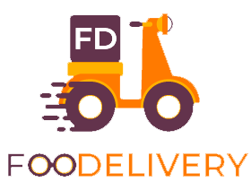

<!-- PROJECT LOGO -->
<br />
<div align="center">
  <a href="https://i.ibb.co/ScTx2Rh/logo.png">
    
  </a>

<h3 align="center">Foodelivery</h3>

  <p align="center">
    Have your favorite dishes delivered anywhere 
  </p>
</div>


<!-- ABOUT THE PROJECT -->
## About The Project

Foodelivery is a website where you can order food from restaurants near you and have it delivered ! The concept is simple: we find the restaurants around you, you choose one, you place your order and you pay the bill via PayPal. You can follow the progress of your order, from preparation to delivery. Enjoy your meal !

<p align="right">
    **Everything here is fictive.
  </p>

### Built With

* React
* NodeJS
* MySQL


<!-- GETTING STARTED -->
## Getting Started

To get a local copy up and running follow these simple example steps.

### Prerequisites

* npm <br />
  ```sh
  npm install npm@latest -g
  ```

### Installation

1. Clone the repo
   ```sh
   git clone https://github.com/chadow4/foodelivery.git
   ```
2. Install NPM packages (in client and server folders)
   ```sh
   npm install
   ```
3. Run the application
   ```js
   npm run start
   ```


<!-- ROADMAP -->
## Roadmap

- [x] Choose a restaurant
- [x] Pick up some food
- [x] Pay for it
- [x] Follow command travel
- [ ] Scan around restaurants by GPS

